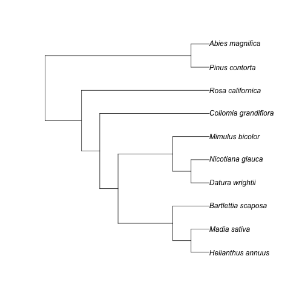

## taxize use case No. 2 - Make a phylogeny from species names alone

There is only functionality for plants right now in taxize. We hope to add more taxan groups soon.


### Load libraries


```r
library(taxize)
```


```r
splist <- c("Helianthus annuus", "Pinus contorta", "Collomia grandiflora", "Abies magnifica", 
    "Rosa californica", "Datura wrightii", "Mimulus bicolor", "Nicotiana glauca", 
    "Madia sativa", "Bartlettia scaposa")
```


### Phylomatic is a web service with an API that we can use to get a phylogeny. 

### Fetch phylogeny from phylomatic 


```r
phylogeny <- phylomatic_tree(taxa = splist, taxnames = TRUE, get = "POST", informat = "newick", 
    method = "phylomatic", storedtree = "R20120829", taxaformat = "slashpath", 
    outformat = "newick", clean = "true", parallel = TRUE)
```


### Format tip-labels 


```r
phylogeny$tip.label <- capwords(phylogeny$tip.label, onlyfirst = TRUE)
```


### Plot phylogeny 


```r
plot(phylogeny)
```

  

